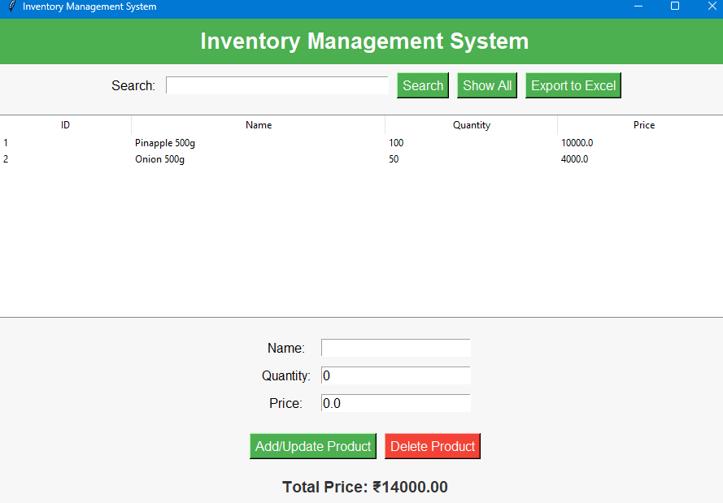

# 📦 Inventory Management System

A desktop-based inventory management tool built with **Python**, **Tkinter**, **SQLite**, and **Pandas**. This system allows you to manage your product inventory easily — add, update, delete, search, and export inventory data with a simple and intuitive GUI.

---

## ✨ Features

- 📝 Add or update products with name, quantity, and price
- 🧮 Automatically calculates and displays total inventory value
- 🔍 Search products by ID or name
- 🗑️ Delete selected products
- 📤 Export entire inventory data to an Excel file
- 📋 View all products in a tabular format
- ✅ Easy-to-use and lightweight desktop application

---

## 🖼️ Screenshot



---

## 🖥️ Tech Stack

- **Python 3**
- **Tkinter** – GUI framework
- **SQLite3** – Local database storage
- **Pandas** – For Excel export

---

## 🚀 How to Run

1. Install required package:
```bash
pip install pandas
```

2. Run the application:
```bash
python inventory_app.py
```

> Replace `inventory_app.py` with the actual name of your Python file.

---

## 🗃️ Database Schema

The SQLite database is named `inventory.db` and contains a single table: `Products`

| Column      | Type     | Description               |
|-------------|----------|---------------------------|
| ProductID   | INTEGER  | Auto-increment primary key|
| Name        | TEXT     | Product name (unique)     |
| Quantity    | INTEGER  | Number of items           |
| Price       | REAL     | Total price               |

---

## 🔧 Project Structure

```
inventory-management/
│
├── inventory_app.py          # Main application file
├── inventory.db              # SQLite database (created automatically)
├── inventorymanagement.png   # Screenshot of the application
└── README.md                 # Project documentation
```

---

## 💡 Future Enhancements

- Export filtered data to Excel  
- Import inventory data from Excel  
- Low-stock alert system  
- Add date tracking and categories  
- Graphical analytics dashboard  

---

## 🤝 Contributing

Contributions are welcome! Feel free to open an issue or submit a pull request.

---

## 📄 License

This project is licensed under the [MIT License](https://opensource.org/licenses/MIT).

---

## 🙌 Acknowledgments

- Python Community  
- Libraries: `tkinter`, `sqlite3`, `pandas`
